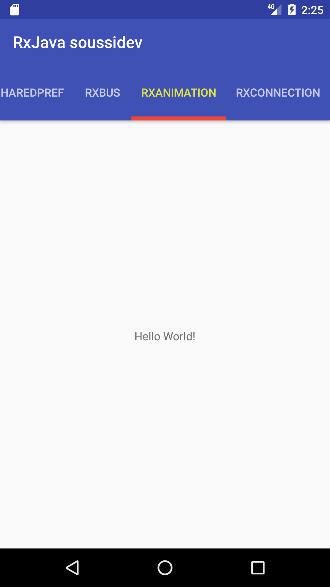
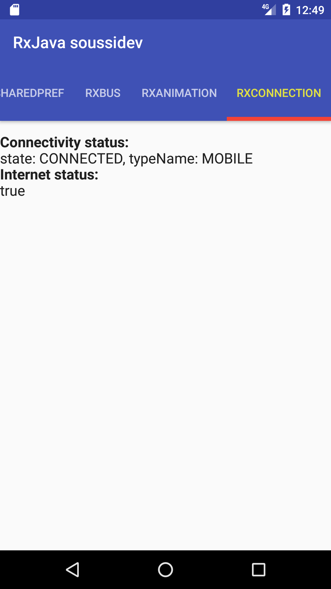

# Rx_java2_soussidev

A simple RxJava Lib contine (RxBus,RxAnimation,RxConnection and RxSharedPref)
<br>
[](https://jitpack.io/#datalink747/Rx_java2_soussidev)

# Preview :
* RxSharedPref :

<br>

* RxBus :

<br>

* RxAnimation :

<br>

* RxConnection :

<br>

# Add dependencie to your project :

```gradle
dependencies {
    compile 'com.github.datalink747:Rx_java2_soussidev:1.2'
}
```
# Code :
> RxPref
```java
public void onViewCreated(View view, @Nullable Bundle savedInstanceState) {
        super.onViewCreated(view, savedInstanceState);

        rxpref=(TextView)view.findViewById(R.id.rxpref);


        final SharedPreferences sharedPreferences = getActivity().getSharedPreferences("prefs", Context.MODE_PRIVATE);
        final RxSharedPreferences_java rxShared = RxSharedPreferences_java.with(sharedPreferences);

        rxShared.putString("dev", "Soussi")
                .flatMap( name-> rxShared.putString("name", "soussi"))
                .flatMap(email -> rxShared.putString("email", "soussi.mohamed747@gmail.com"))
                .flatMap(phone -> rxShared.putInteger("tel", 55055055))
                .flatMap(post -> rxShared.putString("post", "dev android"))

                .flatMap(post -> rxShared.getAll())
                .flatMap(stringMap -> Observable.fromIterable(stringMap.entrySet()))
                .map(Object::toString)

               // .subscribe(s -> Log.d("TAG 1", s)
                .subscribe(s -> textlog1="Subscribe :"+s+"\n"
                );

        rxShared.getInt("tel", 0)
                .subscribe(tel -> {
                    //display phone
                    Log.d("TAG 2", "phone: " + tel);
                    textlog2="phone :"+tel+"\n";
                });

        Observable.just(new Admin())
                .flatMap(user -> rxShared.getInt("id", 0), (admin, id) -> {
                    admin.setId(id);
                    return admin;
                })
                .flatMap(admin -> rxShared.getString("name", ""), (admin, name) -> {
                    admin.setName(name);
                    return admin;
                })

                .flatMap(admin -> rxShared.getString("post", ""), (admin, post) -> {
                    admin.setPost(post);
                    return admin;
                })

                .flatMap(admin -> rxShared.getString("email", ""), (admin, email) -> {
                    admin.setEmail(email);
                    return admin;
                })

                .flatMap(admin -> rxShared.getInt("tel", 0), (admin, phone) -> {
                    admin.setTel(phone);
                    return admin;
                })

                .subscribe(admin -> {
                    //display admin
                    Log.d("TAG 3", admin.toString());
                    Log.d("TAG 4", admin.getEmail());
                    Log.d("TAG 5", admin.getTel().toString());

                    textlog3="admin :"+admin.toString()+"\n";
                    textlog4="admin email :"+admin.getEmail()+"\n";
                    textlog5="admin phone :"+admin.getTel().toString()+"\n";
                    textlog6="admin post :"+admin.getPost().toString()+"\n";

                });

        rxpref.setText(get_data());
    }
    public String get_data()
    {
        sb =new StringBuilder();
        sb.append(textlog1);
        sb.append("\n");
        sb.append(textlog2);
        sb.append("\n");
        sb.append(textlog3);
        sb.append("\n");
        sb.append(textlog4);
        sb.append("\n");
        sb.append(textlog5);
        sb.append("\n");
        sb.append(textlog6);
        return sb.toString();
    }

```
> RxConnection
```java
 @Override
    public void onResume() {
        super.onResume();

        networkDisposable = ReactiveNetwork.observeNetworkConnectivity(getActivity())
                .subscribeOn(Schedulers.io())
                .observeOn(AndroidSchedulers.mainThread())
                .subscribe(connectivity -> {
                    Log.d(TAG, connectivity.toString());
                    final NetworkInfo.State state = connectivity.getState();
                    final String name = connectivity.getTypeName();
                    tvConnectivityStatus.setText(String.format("state: %s, typeName: %s", state, name));
                });

        internetDisposable = ReactiveNetwork.observeInternetConnectivity()
                .subscribeOn(Schedulers.io())
                .observeOn(AndroidSchedulers.mainThread())
                .subscribe(isConnected -> tvInternetStatus.setText(isConnected.toString()));
    }

    @Override
    public void onPause() {
        super.onPause();
        safelyDispose(networkDisposable, internetDisposable);
    }

    private void safelyDispose(Disposable... disposables) {
        for (Disposable subscription : disposables) {
            if (subscription != null && !subscription.isDisposed()) {
                subscription.dispose();
            }
        }
    }
```
> RxActivityResult
```java
 private void getResultActivity()
    {
        final Intent intent = new Intent(getActivity(), Result.class);

        RxActivityResultCompact.startActivityForResult(this, intent, REQUEST_CODE)
                .subscribe(new Consumer<ActivityResult>() {
                    @Override
                    public void accept(@NonNull ActivityResult result) throws Exception {
                        if (result.isOk()) {
                            final String txt = result.getData().getStringExtra(Result.GET_TEXT);
                            textresult.setText(txt);
                        }
                    }
                });

    }
```
* Activity: Result.class
+ Send result
```java
private Intent data = new Intent();

data.putExtra(GET_TEXT, "Service is Disable");
setResult(Activity.RESULT_OK, data);
```

# Linkedin

<a href="https://www.linkedin.com/in/soussimohamed/">

</a>

# Licence
```
Copyright 2017 Soussidev, Inc.

Licensed under the Apache License, Version 2.0 (the "License");
you may not use this file except in compliance with the License.
You may obtain a copy of the License at

   http://www.apache.org/licenses/LICENSE-2.0

Unless required by applicable law or agreed to in writing, software
distributed under the License is distributed on an "AS IS" BASIS,
WITHOUT WARRANTIES OR CONDITIONS OF ANY KIND, either express or implied.
See the License for the specific language governing permissions and
limitations under the License.
```
